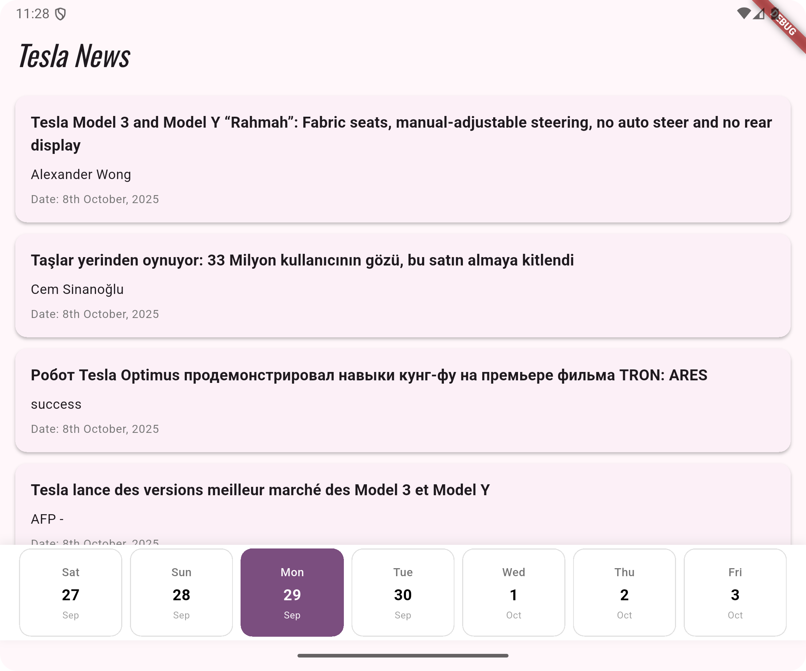

# blocsevendays

A new Flutter project demonstrating BLOC & Repository Pattern with Clean Architecture ideally designed for larger projects.

## Journey

- Splash Screen (Fetching API Key, saving in SharedPreference and Proceeding to main screen)
- Main Screen (Task Requirements)
  - A custom horizontal 7-day calendar (starting from Saturday).
  - Calendar should scroll 7 days at a time when the user swipe.
  - A vertical list view to display data fetched from the API.)

# App Screenshots

Splash Screen API Call and Initial Call

Selection of Dates with Data

# App Screen Recording
[Screen_recording.webm](https://drive.google.com/file/d/15fPFeGq03g0F5PoID9_IOi2BSI5dRwWa/view?usp=sharing)

# Tools Used
- Android Studio (version 2024.3)
- Xcode 26.0.1 - CocoaPods 1.15.2
- Dart version 3.9.2 - DevTools version 2.48.0
- Flutter version 3.35.5 on channel stable at /Users/shitabmir/Android/sdk/flutter

# Used Devices
- Macbook Pro M1 (2020)
- Android Studio Emulator: Pixel Fold API 36

# Used API for Demonstration
- Fetched API Key from my hosted Git Pages.
- NewsAPI  (https://newsapi.org/)

# Testing
- Happy Path Testing for Debug Builds

